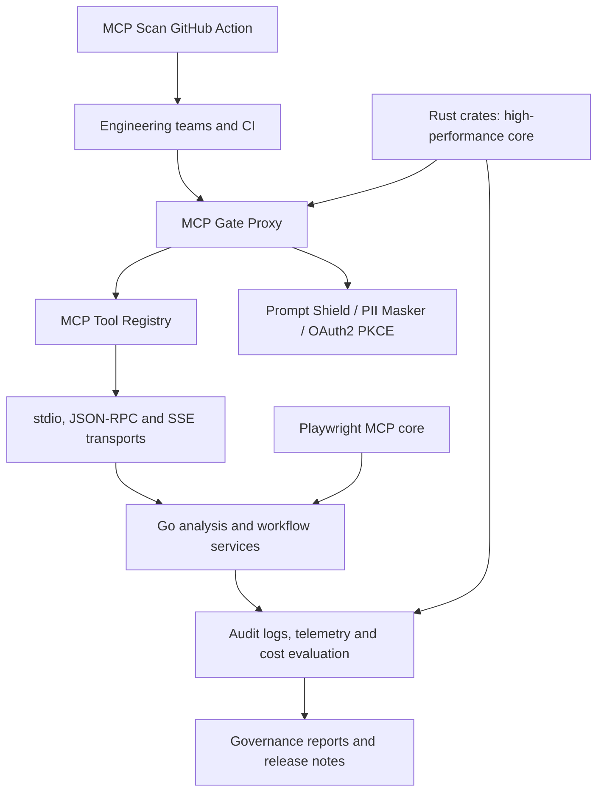

# AI Governance Suite

Kurumsal yapay zeka sistemlerinde politika uygulama, denetlenebilirlik, güvenlik ve kod kalitesi için 30 günlük teslim planına göre düzenlenmiş çok dilli monorepo altyapısı.

[](https://github.com/EnesSamaa/ai-governance-suite/actions/workflows/ci.yml)


git clone https://github.com/EnesSamaa/ai-governance-suite.git
cargo test --workspace


## Mimari



### 🧪 Rust Workspace Test Verification Matrix

All 14 crates in the Rust workspace compile cleanly and pass verification (`cargo test --workspace`):

| Crate Name | Test Suite Focus | Status | Tests Passed |
| :--- | :--- | :---: | :---: |
| `ai_governance_suite` | Permitted & denied orchestration flow | ✅ | 2 / 2 |
| `dom_a11y_tree` | Semantic node extraction & hidden content filtering | ✅ | 2 / 2 |
| `ebpf_net_tracer` | Approved traffic, destination/process violations & port security | ✅ | 3 / 3 |
| `hipaa_log_audit` | Identifier anonymization & required field detection | ✅ | 2 / 2 |
| `k6_mcp_runner` | Metric aggregation & throughput derivation | ✅ | 3 / 3 |
| `mcp_gate_proxy` | Allowlist enforcement & PII payload rejection | ✅ | 2 / 2 |
| `mcp_tool_registry` | Concurrent tool registration & removal | ✅ | 3 / 3 |
| `pii_masker_stream` | Multi-chunk secret masking & false-positive handling | ✅ | 3 / 3 |
| `ringbuf_telemetry` | Overwrite logic & lock-free concurrent writers | ✅ | 3 / 3 |
| `tui_diff_viewer` | Unified diff parsing & viewport navigation | ✅ | 1 / 1 |
| `zero_mem_cache` | Deduplication, shared context & cache eviction | ✅ | 2 / 2 |

> **Verification Summary:** **24 total unit tests passed across 14 workspace crates with 0 failures.**

## Depo yapisi

- `crates/`: Rust workspace; performans-kritik politika, telemetri, denetim ve gelistirici deneyimi bilesenleri.
- `services/`: Go workspace; ag, protokol, analiz ve operasyon servisleri.
- `playwright-mcp-core/`: TypeScript tabanli tarayici otomasyonu MCP cekirdegi.
- `mcp-scan-action/`: Docker tabanli GitHub Action iskeleti.

## 30 gunluk yol haritasi

| Gun | Modul | Teslim odaği |
| --- | --- | --- |
| 1 | ast-diff-core | AST fark motoru |
| 2 | dead-code-elim | Olü kod analizi |
| 3 | mcp-transport-stdio | Stdio tasimasi |
| 4 | mcp-tool-registry | Arac kayit defteri |
| 5 | pii-masker-stream | Akan PII maskeleme |
| 6 | mcp-gate-proxy | Politika gecidi |
| 7 | ringbuf-telemetry | Telemetri tamponu |
| 8 | ebpf-net-tracer | Ag izleme |
| 9 | dom-a11y-tree | Erisilebilirlik agaci |
| 10 | k6-mcp-runner | Yuk testi calistiricisi |
| 11 | tui-diff-viewer | Terminal fark goruntuleyici |
| 12 | hipaa-log-audit | HIPAA denetim gunlugu |
| 13 | zero-mem-cache | Sifir-kopya onbellek |
| 14 | ai-governance-suite | Rust birlestirici facade |
| 15 | cfg-analyzer | Yapilandirma analizi |
| 16 | mcp-jsonrpc-proto | JSON-RPC protokol katmani |
| 17 | mcp-transport-sse | SSE tasimasi |
| 18 | prompt-shield-go | Prompt guvenligi |
| 19 | oauth2-pkce-mcp | Kimlik dogrulama |
| 20 | schema-hash-verifier | Semaya butunluk dogrulama |
| 21 | context-file-parser | Baglam dosyasi ayrisma |
| 22 | firecrawl-mcp-go | Web toplama adaptoru |
| 23 | db-schema-introspect | Veritabani sema kesfi |
| 24 | git-guided-diff | Git tabanli fark rehberi |
| 25 | gum-workflow-cli | Etkilesimli is akisi CLI |
| 26 | cost-governance-eval | Maliyet yonetisimi degerlendirmesi |
| 27 | release-notes-agent | Surum notu otomasyonu |
| 28 | micro-saas-billing | Faturalama servisi |
| 29 | playwright-mcp-core | Tarayici MCP cekirdegi |
| 30 | mcp-scan-action | CI yonetisim taramasi |

## Kurulum ve dogrulama

Gereksinimler: Rust 1.75+, Go 1.22+, Node.js 20+ (TypeScript modulu icin) ve Docker (Action testi icin).

```bash
git clone <repository-url>
cd ai-governance-suite
cargo test --workspace
for service in services/*; do (cd "$service" && go test ./...); done
```

`go.work`, tum Go servislerini yerel gelistirme workspace'ine dahil eder. Her servis ayri bir Go modulu oldugundan, Go testleri modullerin kendi dizinlerinde calistirilir. CI, her `push` olayinda ayni Rust ve Go testlerini calistirir.
