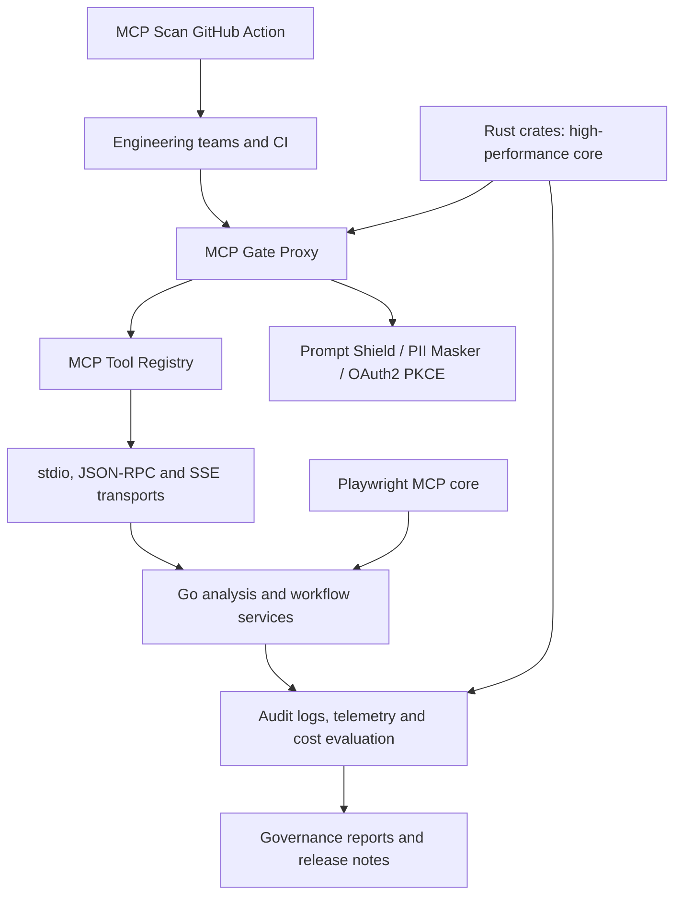

# AI Governance Suite

A multilingual monorepo foundation organized around a 30-day delivery plan for policy enforcement, auditability, security, and code quality in enterprise AI systems.

[](https://github.com/EnesSamaa/ai-governance-suite/actions/workflows/ci.yml)


```bash
git clone https://github.com/EnesSamaa/ai-governance-suite.git
cd ai-governance-suite
cargo test --workspace
```

## Architecture



## Rust Workspace Test Verification Matrix

All Rust workspace crates compile cleanly and pass verification with `cargo test --workspace`.

| Crate Name | Test Suite Focus | Status | Tests Passed |
| :--- | :--- | :---: | :---: |
| `ai_governance_suite` | Permitted and denied orchestration flows | ✅ | 2 / 2 |
| `dom_a11y_tree` | Semantic node extraction and hidden-content filtering | ✅ | 2 / 2 |
| `ebpf_net_tracer` | Approved traffic, destination/process violations, and port security | ✅ | 3 / 3 |
| `hipaa_log_audit` | Identifier anonymization and required-field detection | ✅ | 2 / 2 |
| `k6_mcp_runner` | Metric aggregation and throughput derivation | ✅ | 3 / 3 |
| `mcp_gate_proxy` | Allowlist enforcement and PII payload rejection | ✅ | 2 / 2 |
| `mcp_tool_registry` | Concurrent tool registration and removal | ✅ | 3 / 3 |
| `pii_masker_stream` | Multi-chunk secret masking and false-positive handling | ✅ | 3 / 3 |
| `ringbuf_telemetry` | Overwrite logic and lock-free concurrent writers | ✅ | 3 / 3 |
| `tui_diff_viewer` | Unified diff parsing and viewport navigation | ✅ | 1 / 1 |
| `zero_mem_cache` | Deduplication, shared context, and cache eviction | ✅ | 2 / 2 |

## Repository Structure

- `crates/`: Rust workspace for performance-critical policy, telemetry, auditing, and developer-experience components.
- `services/`: Go workspace for networking, protocol, analysis, and operational services.
- `playwright-mcp-core/`: TypeScript MCP core for browser automation.
- `mcp-scan-action/`: Docker-based GitHub Action for MCP security scanning.

## 30-Day Roadmap

| Day | Module | Delivery Focus |
| --- | --- | --- |
| 1 | ast-diff-core | AST diff engine |
| 2 | dead-code-elim | Dead-code analysis |
| 3 | mcp-transport-stdio | Stdio transport |
| 4 | mcp-tool-registry | Tool registry |
| 5 | pii-masker-stream | Streaming PII masking |
| 6 | mcp-gate-proxy | Policy gateway |
| 7 | ringbuf-telemetry | Telemetry buffer |
| 8 | ebpf-net-tracer | Network tracing |
| 9 | dom-a11y-tree | Accessibility tree |
| 10 | k6-mcp-runner | Load-test runner |
| 11 | tui-diff-viewer | Terminal diff viewer |
| 12 | hipaa-log-audit | HIPAA audit logging |
| 13 | zero-mem-cache | Zero-copy cache |
| 14 | ai-governance-suite | Rust orchestration facade |
| 15 | cfg-analyzer | Configuration analysis |
| 16 | mcp-jsonrpc-proto | JSON-RPC protocol layer |
| 17 | mcp-transport-sse | SSE transport |
| 18 | prompt-shield-go | Prompt security |
| 19 | oauth2-pkce-mcp | Authentication |
| 20 | schema-hash-verifier | Schema integrity verification |
| 21 | context-file-parser | Context-file parsing |
| 22 | firecrawl-mcp-go | Web crawling adapter |
| 23 | db-schema-introspect | Database schema discovery |
| 24 | git-guided-diff | Git-guided review |
| 25 | gum-workflow-cli | Interactive workflow CLI |
| 26 | cost-governance-eval | Cost-governance evaluation |
| 27 | release-notes-agent | Release-note automation |
| 28 | micro-saas-billing | Billing service |
| 29 | playwright-mcp-core | Browser-automation MCP core |
| 30 | mcp-scan-action | CI governance scanning |

## Setup and Verification

Requirements: Rust 1.75+, Go 1.22+, Node.js 20+ for the TypeScript module, and Docker for Action testing.

```bash
git clone <repository-url>
cd ai-governance-suite
cargo test --workspace
for service in services/*; do (cd "$service" && go test ./...); done
```

`go.work` includes every Go service in the local development workspace. Because each service is an independent Go module, tests run from each module directory. CI runs the same Rust and Go tests on every push.
